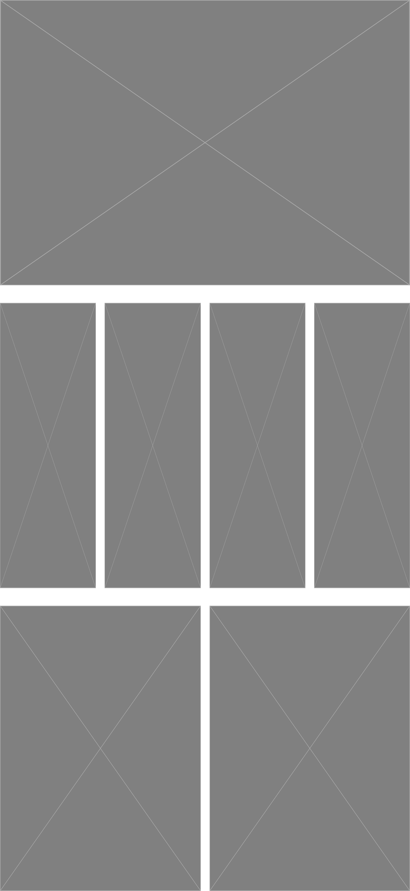

# SDWebImageMockPlugin

[](https://cocoapods.org/pods/SDWebImageMockPlugin)
[](https://cocoapods.org/pods/SDWebImageMockPlugin)
[](https://cocoapods.org/pods/SDWebImageMockPlugin)
[](https://github.com/faberNovel/SDWebImageMockPlugin/actions/workflows/ci.yml)

SDWebImageMockPlugin makes possible the creation of snapshot testing with views using [SDWebImage](https://github.com/SDWebImage/SDWebImage) to configure images.

## Example

To run the example project, clone the repo, and run `pod install` from the Example directory first.

## Getting Started

This modules provides a `ImageCacheMocker` which allow you to mock all images requested by SDWebImage.
To enable its mocking capabilities call its method `setupSDWebImageMocking()`, after that all requests from SDWebImage 
will use this cache instance.

```swift
class Tests: XCTestCase {

    var imageMocker = ImageCacheMocker()

    override func setUp() {
        super.setUp()
        imageMocker.setupSDWebImageMocking()
    }
    
    // Your snapshot tests here
}
```

Once the mocker in place the image configured by SDWebImage will depend on the url format. 
Here the list of the default behaviors:
- `size://1920x1080` will provide an image with a width of 1920pt and an height of 1080pt
- `ratio://3:2` will provide an image with a ratio of `3/2` and a constant height of 500pt
- `bundle://main/mySampleImage` will provide the image named `mySampleImage` from `Bundle.main` (by default `main` is the only identifier configured in ImageCacheMocker)

Any other urls will return a default image.

Extension on `URL` are provided to construct those default urls:
```swift
URL.imageMock(forWidth: 500, height: 100) // -> size://500x100
URL.imageMock(withRatio: Double(16) / Double(9)) // -> ratio://1.7777777777777777:1 (equivalent to ratio://16:9)
URL.imageMock(named: "sampleImage1", inBundleID: "testBundle") // -> bundle://testBundle/sampleImage1
```

Those behaviors are customizable by registering a custom image provider using `ImageCacheMocker.registerProvider(:)`.

You can find the example Tests here: [Tests.swift](./Example/Tests/Tests.swift),
and the snapshots for those tests:

<table>
<tr>
<td><a href="./Example/Tests/__Snapshots__/Tests/testViewController.1.png">testViewController.1.png</a></td>
<td><a href="./Example/Tests/__Snapshots__/Tests/testMultipleImagesViewController.1.png">testMultipleImagesViewController.1.png</a></td>
<td><a href="./Example/Tests/__Snapshots__/Tests/testConfiguredMultipleImagesViewController.1.png">testConfiguredMultipleImagesViewController.1.png</a></td>
</tr>
<tr>
<td></td>
<td></td>
<td></td>
</tr>
</table>

## Installation

### Cocoapods

`SDWebImageMockPlugin` is available through [CocoaPods](https://cocoapods.org). To install
it, simply add the following line to your Podfile:

```ruby
pod 'SDWebImageMockPlugin'
```

### Swift Package Manager

`SDWebImageMockPlugin` can be installed as a Swift Package with Xcode 11 or higher. To install it, add a package using Xcode or a dependency to your Package.swift file:

```swift
.package(url: "https://github.com/faberNovel/SDWebImageMockPlugin")
```

## Credits

SDWebImageMockPlugin is owned and maintained by [Fabernovel](https://www.fabernovel.com/). You can follow us on Twitter at [@Fabernovel](https://twitter.com/FabernovelTech).

## License

`SDWebImageMockPlugin` is available under the MIT license. See the LICENSE file for more info.
